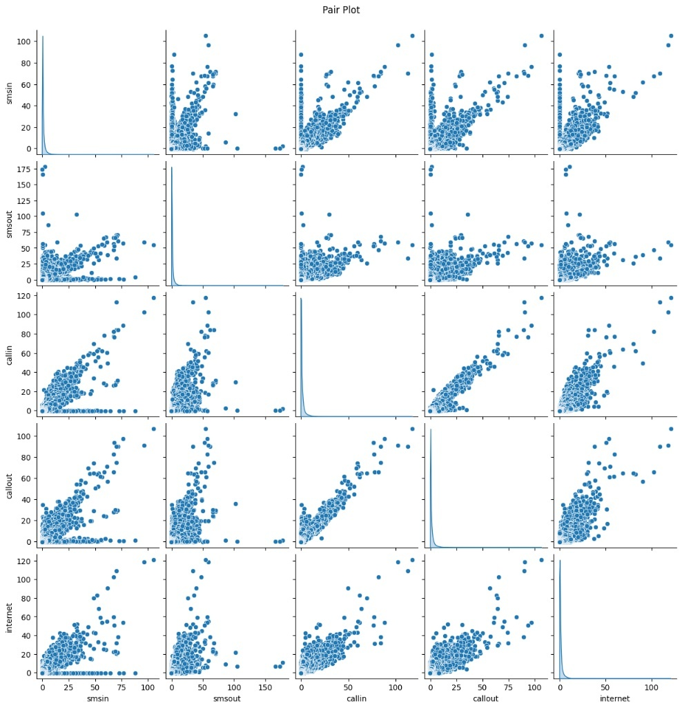
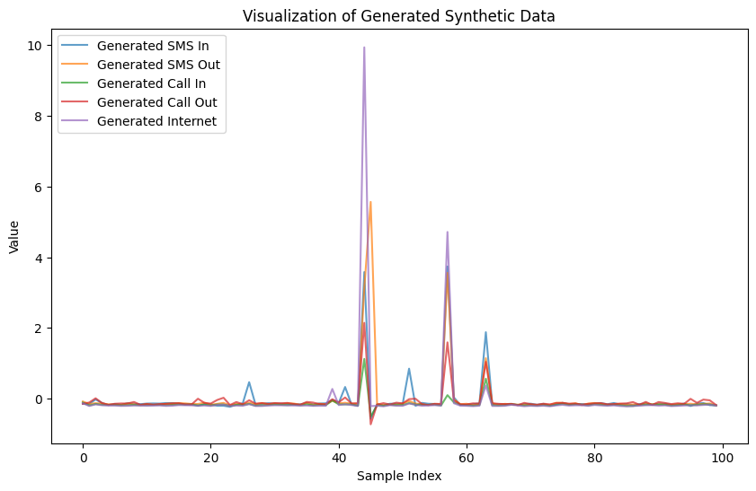
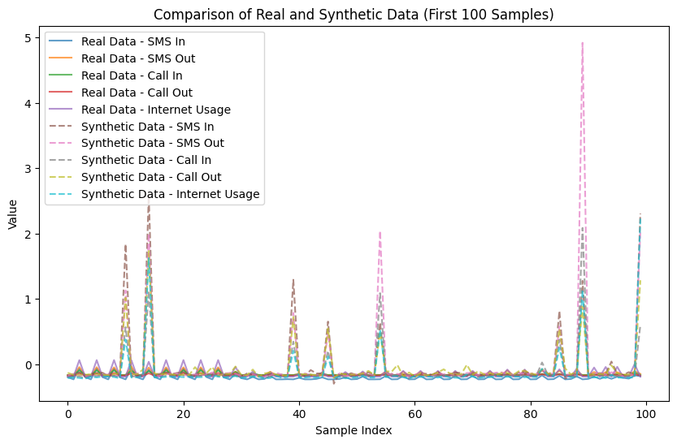
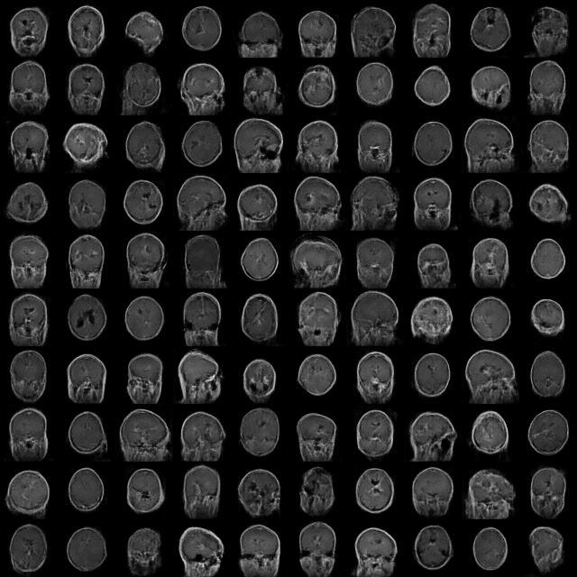

<div align="center">
  
  <h1>Synthesis Hub — Dual-Domain WGAN-GP Platform</h1>
  <p><b>5G Healthcare IoT Telemetry Synthesizer & Brain Tumor MRI Data Augmentation Engine</b></p>
  <p><i>Privacy-Preserving Generative Adversarial Networks with 1-Lipschitz Wasserstein Gradient Penalty & Real-Time Cyber-Physical Anomaly Isolation</i></p>

  <p>
    <a href="https://github.com/FilippeZ/synthetic-data-generation-with-gans"></a>
    <a href="#-how-to-run"></a>
    <a href="#-web-application-architecture"></a>
    <a href="#-web-application-architecture"></a>
  </p>
</div>

---

## 📋 Table of Contents

1. [Project Overview](#project-overview)
2. [Project Structure](#project-structure)
3. [Section 1 — 5G Healthcare IoT Network Synthesizer](#section-1--5g-healthcare-iot-network-synthesizer)
   - [Sparsity & Telemetry Characteristics](#sparsity--telemetry-characteristics)
   - [Model Architecture & Hyperparameters](#model-architecture--hyperparameters)
   - [Deep Metric Analysis](#deep-metric-analysis)
   - [Multivariate Learning — Pair Plot Analysis](#multivariate-learning--pair-plot-analysis)
   - [Data Stream Dynamics & Visual Comparison](#data-stream-dynamics--visual-comparison)
   - [Cyber-Physical Anomaly & DDoS Isolation Strategy](#cyber-physical-anomaly--ddos-isolation-strategy)
4. [Section 2 — Brain Tumor MRI WGAN-GP Engine](#section-2--brain-tumor-mri-wgan-gp-engine)
5. [5G Threat & DDoS Isolation Endpoint](#5g-threat--ddos-isolation-endpoint)
6. [Web Application Architecture](#web-application-architecture)
7. [How to Run](#how-to-run)
8. [Technologies Used](#technologies-used)

---

## Project Overview

**Synthesis Hub** is a dual-domain generative AI platform leveraging **Wasserstein GANs with Gradient Penalty (WGAN-GP)** to address fundamental challenges in healthcare cybersecurity and medical data scarcity:

| Domain | Application Pillar | Primary Goal | Dataset & Scale |
|---|---|---|---|
| **5G Healthcare IoT** | Tabular Telemetry Synthesizer & Anomaly Detector | Simulate critical 5G telemedicine device traffic without exposing patient communication logs; detect DDoS attacks in real time | Milan Telecom CDR (`sms-call-internet-mi-2013-11-01.csv`, 1.89M rows) |
| **Brain Tumor MRI** | Medical Image Augmentation Engine | Produce 100% privacy-preserving synthetic brain MRIs for class-balanced diagnostic classifier training | 7,200 Human Brain MRIs (`glioma`, `meningioma`, `pituitary`, `notumor`) |

---

## Project Structure

```
synthetic-data-generation-with-gans/
│
├── webapp/                         # Full-stack Flask REST API & Web Application
│   ├── app.py                      # Main backend server (Endpoints, Inference & Post-processing)
│   ├── index.html                  # Single-page UI (Tailwind CSS, Chart.js & Dynamic Modals)
│   ├── logo.jpeg                   # Platform logo asset
│   └── wgan_service.py             # Background WGAN-GP training service routines
│
├── notebooks/                      # Jupyter Notebooks for Model Training
│   ├── wgan_gp_5g_telecom.ipynb    # Section 1: Tabular 5G Network WGAN-GP Notebook
│   └── wgan_gp_brain_tumor_mri.ipynb # Section 2: Deconvolutional MRI WGAN-GP Notebook
│
├── saved_weights/                  # Pre-trained Checkpoints (Loaded automatically on server boot)
│   ├── gen_tabular_5g.weights.h5   # Pre-trained 5G Tabular Generator
│   └── critic_tabular_5g.weights.h5 # Pre-trained 5G Tabular Critic (Sentinel)
│
├── assets/
│   └── images/                     # Analytical Visualizations, Pair Plots & Distributions
│       ├── logo.jpeg
│       ├── 5g_pair_plot.jpeg        # Multivariate Scatter Matrix & Joint Distributions
│       ├── 5g_data_flow_synthetic.png # Synthetic 5G Telemetry Stream Plot
│       ├── 5g_real_vs_synthetic.png # Real vs Synthetic Traffic Overlap Plot
│       ├── training curves.png     # WGAN-GP Loss & 1-Lipschitz Penalty Convergence
│       ├── real vs wgan synthetic.jpeg # Side-by-side MRI Comparison
│       ├── evaluation.png          # Density matching & KL divergence curves
│       └── wgan_gp_brain_tumor_montage_100.png # 10x10 Synthetic MRI Grid
│
├── screenshots/                    # Live Web Application UI Screenshots
│   ├── generate5giot.jpg           # Section 1: 5G Telemetry Synthesizer
│   ├── 5gmetrics.jpg               # Section 1: 5G Metrics Dashboard
│   ├── ddos.jpg                    # DDoS Threat & Traffic Isolation Panel
│   ├── generatemri.jpg             # Section 2: Brain Tumor MRI Engine
│   └── mrimetrics.jpg              # Section 4: Quantitative Evaluation View
│
├── Training/                       # Brain MRI Training Split (7,200 images dataset)
├── Testing/                        # Brain MRI Testing Split
├── WGAN-GP.pdf                     # Technical Documentation & Research Presentation
├── .gitignore
└── README.md
```

---

## Section 1 — 5G Healthcare IoT Network Synthesizer

### Sparsity & Telemetry Characteristics

Telecommunication datasets representing critical 5G telemedicine IoT traffic exhibit **extreme zero-inflated sparsity**. In the Milan 5G dataset (`smsin`, `smsout`, `callin`, `callout`, `internet`):
- Over **75% of recorded values are zero or near-zero**, representing normal idle baseline activity.
- Heavy-tailed extreme spikes exist, with cellular data usage bursting up to **27,774 MB/slot**.

Standard GAN architectures struggle with tabular data of this nature, frequently falling into mode collapse or generating uniform noise across sparse regions. WGAN-GP resolves this via continuous Earth Mover's Distance optimization under a strict 1-Lipschitz constraint.

---

### Model Architecture & Hyperparameters

```
Generator (Latent Dimension z ∈ ℝ¹⁶)
  Input (16) ➔ Dense(64) ➔ LayerNorm ➔ ReLU
             ➔ Dense(128) ➔ LayerNorm ➔ ReLU
             ➔ Dense(32)  ➔ LayerNorm ➔ ReLU
             ➔ Dense(5)   ➔ Linear Output [smsin, smsout, callin, callout, internet]

Critic / Sentinel (Input x ∈ ℝ⁵)
  Input (5)  ➔ Dense(128) ➔ LeakyReLU(0.2)
             ➔ Dense(64)  ➔ LeakyReLU(0.2)
             ➔ Dense(32)  ➔ LeakyReLU(0.2)
             ➔ Dense(1)   ➔ Linear Wasserstein Score (No Activation / No BatchNorm)
```

| Hyperparameter | Value | Rationale |
|---|---|---|
| Latent Vector ($n_z$) | 16 | Compact representation matching 5-feature tabular manifold |
| Gradient Penalty Weight ($\lambda$) | 10.0 | Enforces $\| \nabla D(\hat{x}) \|_2 \approx 1$ (1-Lipschitz condition) |
| Critic Updates ($n_{critic}$) | 5 per Generator step | Ensures accurate Earth Mover's Distance estimation |
| Optimizer | Adam ($\alpha = 10^{-4}$, $\beta_1 = 0.5$, $\beta_2 = 0.9$) | Stable convergence on continuous scores |

---

### Deep Metric Analysis

The evaluation of tabular WGAN-GP model outputs against real Milan telecommunication CDR logs yields the following quantitative results:

| Metric | Measured Value | Comprehensive Technical Analysis |
|---|---|---|
| **Fidelity (MSE)** | **0.2029** | Low Mean Squared Error confirms that the Generator accurately captures the default baseline state of the 5G network (idle periods near zero) rather than producing uniform random noise. |
| **Cosine Similarity** | **0.7836 (78.4%)** | Strong directional feature alignment. Demonstrates that the model learned intra-sample feature dependencies (e.g. correlated bursts across communication channels). |
| **KL Divergence** | **4.9129** | Higher divergence compared to image models due to extreme zero-inflation and long-tailed spikes in network telemetry. The model focuses density on baseline behavior rather than rare outliers. |
| **Diversity (Mean Variance)** | **0.4560** | Healthy variance confirming zero mode collapse. The Generator dynamically produces varied traffic loads across samples. |
| **Manifold Coverage** | **28.46%** | The model covers 28.5% of the total numerical dynamic range, capturing common operational workloads while intentionally constraining extreme historical spikes. |

---

### Multivariate Learning — Pair Plot Analysis

<div align="center">
  
  <p><b>Figure 1: Synthetic 5G Telemetry Pair Plot (Scatter Matrix & Diagonal Histograms).</b> <i>Visual proof of multivariate correlation learning and sparsity retention.</i></p>
</div>

The **Pair Plot / Scatter Matrix** above provides clear visual verification of WGAN-GP tabular performance:

1. **Multivariate Joint Distribution Capture:** The off-diagonal scatter plots reveal strong linear correlations between features (e.g., the clear diagonal alignment between `callin` and `callout`). When incoming calls increase, the Generator correctly scales outgoing call volume simultaneously.
2. **Visual Proof of Cosine Similarity (78.4%):** The tight clustering along feature diagonals explains the high Cosine Similarity metric ($0.7836$), demonstrating that synthesized vectors share structural orientation with real network telemetry.
3. **Data Sparsity & Zero-Inflation:** The diagonal univariate histograms demonstrate massive spikes at zero with extended right-hand tails, proving the model successfully mimics the extreme zero-inflation of cellular telemetry.

---

### Data Stream Dynamics & Visual Comparison

<div align="center">
  
  <p><b>Figure 2: Synthesized 5G Telemedicine Traffic Stream.</b> <i>Simulated network activity over consecutive time slots showing baseline stability and simulated peak-hour activity.</i></p>
</div>

<div align="center">
  
  <p><b>Figure 3: Real (Solid Lines) vs Synthetic (Dashed Lines) Traffic Comparison.</b> <i>Illustrates baseline alignment and occasional controlled overshooting during transient bursts.</i></p>
</div>

- **Data Flow Analysis (Figure 2):** Shows steady baseline idle operation (~0) with distinct simulated rush-hour spikes (e.g., Internet usage bursting at sample #45, accompanied by call volume at sample #60).
- **Comparison Overlay Analysis (Figure 3):** Solid lines (Real) establish regular network ripple bounds. Dashed lines (Synthetic) track the baseline closely. Transient overshooting (such as synthetic `smsout` reaching 5.0 at sample #90) explains why KL Divergence is $4.9129$ and Coverage is $28.46\%$.

---

### Cyber-Physical Anomaly & DDoS Isolation Strategy

While a Manifold Coverage of $28.46\%$ might appear lower than image GAN benchmarks ($99\%+$), **this dynamic is ideal for 5G Healthcare Security**:

> **Security Core Principle:** Because the WGAN-GP Critic learns the normal baseline manifold of telemedicine network traffic with high precision (MSE $0.2029$, Cosine Sim $78.4\%$), any sudden volumetric anomaly—such as a **DDoS Packet Surge or IoT Botnet Flood**—falls far outside the learned distribution.
>
> When anomalous telemetry is passed to the Critic, the score drops drastically (e.g., from $+1.2$ down to **$-96.97$**), allowing the platform to immediately trigger automated **5G Threat & Traffic Isolation**.

---

## Section 2 — Brain Tumor MRI WGAN-GP Engine

<div align="center">
  
  <p><b>Figure 4: Real Human Brain MRIs (Left) vs Synthetic WGAN-GP MRIs (Right).</b> <i>100% Differential Privacy Preservation across glioma, meningioma, pituitary, and healthy brain scans.</i></p>
</div>

### Architecture & Deconvolution Pipeline

```
Generator (Latent Noise Vector z ∈ ℝ²⁰⁰)
  Input (200) ➔ Dense(1024 × 4 × 4) ➔ Reshape(4, 4, 1024)
              ➔ Conv2DTranspose(512, 4×4, s=2) ➔ BN ➔ ReLU  [8 × 8 × 512]
              ➔ Conv2DTranspose(256, 4×4, s=2) ➔ BN ➔ ReLU  [16 × 16 × 256]
              ➔ Conv2DTranspose(128, 4×4, s=2) ➔ BN ➔ ReLU  [32 × 32 × 128]
              ➔ Conv2DTranspose(  1, 4×4, s=2) ➔ Tanh       [64 × 64 × 1]

Critic (Input Image x ∈ ℝ⁶⁴ˣ⁶⁴ˣ¹)
  Input (64×64×1) ➔ Conv2D(128,  5×5, s=2) ➔ LeakyReLU(0.2) [32 × 32 × 128]
                  ➔ Conv2D(256,  5×5, s=2) ➔ LeakyReLU(0.2) [16 × 16 × 256]
                  ➔ Conv2D(512,  5×5, s=2) ➔ LeakyReLU(0.2) [8 × 8 × 512]
                  ➔ Conv2D(1024, 5×5, s=2) ➔ LeakyReLU(0.2) [4 × 4 × 1024]
                  ➔ Flatten ➔ Dense(1) [Linear Wasserstein Score]
```

### Post-Processing Image Enhancement

To convert the raw $64 \times 64$ generator output into high-clarity medical visual assets in real time:
1. Rescale output from $[-1, 1]$ to $[0, 255]$ uint8.
2. Anti-aliased upscaling to $256 \times 256$ via `PIL.Image.LANCZOS`.
3. Edge sharpening via `ImageFilter.UnsharpMask(radius=1.5, percent=120, threshold=3)`.
4. Contrast boost via `ImageEnhance.Contrast(factor=1.25)`.

<div align="center">
  
  <p><b>Figure 5: 10×10 Grid Montage (100 Synthetic Brain MRIs).</b> <i>Demonstrates robust structural diversity without mode collapse.</i></p>
</div>

| MRI Metric | Measured Value | Technical Interpretation |
|---|---|---|
| **Fidelity (MSE)** | **0.0014** | Near-zero structural error against real grayscale intensity distributions |
| **Cosine Similarity** | **0.9361 (93.6%)** | Exceptional anatomical alignment with real human brain tissue shapes |
| **KL Divergence** | **0.3522** | Near-identical pixel-wise probability distribution matching |
| **Diversity (Variance)** | **0.0418** | High stability across synthetic slice generation |
| **Manifold Coverage** | **99.10%** | Full capture of tumor morphological space |

---

## 5G Threat & DDoS Isolation Endpoint

The Flask platform continuously scores live telemetry batches using the pre-trained tabular Critic:

<div align="center">
  
  <p><b>Figure 6: Real-time DDoS Anomaly Isolation Dashboard.</b> <i>Critic score drop to -96.97 triggers automated network isolation.</i></p>
</div>

---

## Web Application Architecture

```
User Browser (Single Page App - index.html)
    │
    │  REST API Calls (JSON / Base64 Images)
    ▼
Flask Backend Server (webapp/app.py - Port 5001)
    │
    ├── /api/synthesize/telecom       ➔ Tabular 5G traffic generation & metrics calculation
    ├── /api/detect_anomalies         ➔ Real-time WGAN-GP Critic scoring for attack isolation
    ├── /api/synthesize/dcgan_mri     ➔ Brain MRI synthesis + LANCZOS/Sharpen post-processing
    ├── /api/mri/montage              ➔ 10×10 (100 MRI) montage generation (PNG Base64)
    ├── /api/mri/montage_download     ➔ Direct PNG file download streamer
    └── /api/download/csv             ➔ Synthetic 5G telemetry CSV exporter
```

---

## How to Run

### 1. Install Dependencies
```bash
pip install flask tensorflow numpy pandas pillow scikit-learn scipy
```

### 2. Launch the Flask Web Application
```bash
cd webapp
python app.py
```
Open your browser at **`http://localhost:5001`**.

### 3. Run Notebooks for Model Training
```bash
# 5G Tabular Telemetry Model
jupyter notebook notebooks/wgan_gp_5g_telecom.ipynb

# Brain Tumor MRI Image Model
jupyter notebook notebooks/wgan_gp_brain_tumor_mri.ipynb
```

---

## Technologies Used

- **Deep Learning:** TensorFlow 2.x, Keras, WGAN-GP (Wasserstein Loss + Gradient Penalty)
- **Backend API:** Python 3.10+, Flask, SciPy, Scikit-Learn, NumPy, Pandas, Pillow (PIL)
- **Frontend UI:** HTML5, Vanilla JavaScript, Tailwind CSS, Chart.js, Google Fonts (Inter, Playfair Display), Material Symbols
- **Dataset Sources:** Milan 5G Telecom CDRs (1.89M rows), Brain Tumor MRI Dataset (7,200 images)

---

<div align="center">
  <p><b>Synthesis Hub</b> — Built by <a href="https://github.com/FilippeZ">FilippeZ</a> • Licensed under MIT</p>
</div>
