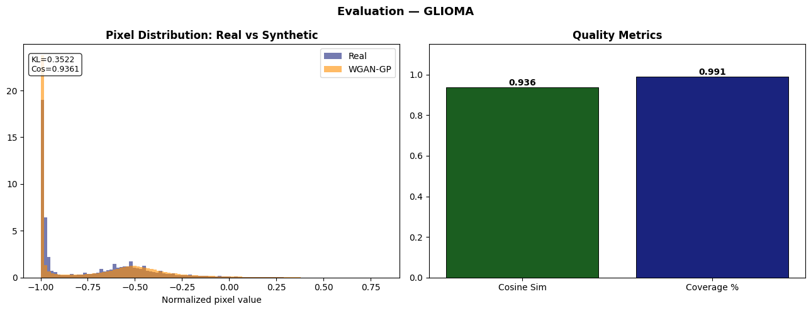

# Synthesis Hub — WGAN-GP Synthetic Data Platform

> **Dual-domain WGAN-GP engine** for **5G Healthcare IoT** tabular telemetry synthesis and **Brain Tumor MRI** image augmentation — with real-time inference, anomaly detection, and quantitative evaluation metrics, served via a full-stack Flask web application.

---

## 📋 Table of Contents

1. [Project Overview](#project-overview)
2. [Project Structure](#project-structure)
3. [Section 1 — 5G Healthcare IoT Network Synthesizer](#section-1--5g-healthcare-iot-network-synthesizer)
4. [Section 2 — Brain Tumor MRI WGAN-GP Engine](#section-2--brain-tumor-mri-wgan-gp-engine)
5. [5G Threat & DDoS Isolation](#5g-threat--ddos-isolation)
6. [Quantitative Evaluation Metrics](#quantitative-evaluation-metrics)
7. [Web Application Architecture](#web-application-architecture)
8. [How to Run](#how-to-run)
9. [Training Results & Evaluation](#training-results--evaluation)
10. [Technologies Used](#technologies-used)

---

## Project Overview

This project implements **Wasserstein GAN with Gradient Penalty (WGAN-GP)** across two distinct domains:

| Domain | Task | Dataset | Output |
|---|---|---|---|
| **5G Healthcare IoT** | Tabular telemetry synthesis | Milan Telecom CDR 1.89M rows | Synthetic network traffic (SMS, calls, internet) |
| **Brain Tumor MRI** | Medical image augmentation | 7,200 Brain MRI scans (4 classes) | 64×64 grayscale synthetic MRIs, post-processed to 256×256 |

**Key contributions:**
- **Privacy-preserving data augmentation** — no real patient data leaves the system
- **Real-time DDoS detection** using the Wasserstein Critic score as anomaly signal
- **Full-stack web app** with live inference, side-by-side comparison, and CSV export
- Faithful **TensorFlow 2.x Keras** re-implementation of Lasagne/Theano DCGAN architecture

---

## Project Structure

```
synthetic-data-generation-with-gans/
│
├── webapp/                         # Flask backend + Frontend UI
│   ├── app.py                      # Main Flask server (REST API + model inference)
│   ├── index.html                  # Single-page application (Tailwind CSS + Chart.js)
│   └── wgan_service.py             # WGAN-GP training service utilities
│
├── notebooks/                      # Jupyter training notebooks
│   ├── wgan_gp_5g_telecom.ipynb    # Section 1: 5G tabular WGAN-GP training
│   └── wgan_gp_brain_tumor_mri.ipynb # Section 2: Brain MRI WGAN-GP training
│
├── saved_weights/                  # Pre-trained model weights (auto-loaded on startup)
│   ├── gen_tabular_5g.weights.h5   # 5G tabular generator weights
│   └── critic_tabular_5g.weights.h5
│
├── assets/
│   └── images/                     # Evaluation plots & training curves
│       ├── 5g_pair_plot.jpeg
│       ├── 5g_data_flow_synthetic.png
│       ├── 5g_real_vs_synthetic.png
│       ├── training curves.png
│       ├── evaluation.png
│       ├── real vs wgan synthetic.jpeg
│       ├── sample exported.png
│       ├── wgan_gp_brain_tumor_montage_100.png
│       └── latent space interpolation.png
│
├── screenshots/                    # Web app UI screenshots
│   ├── generate5giot.jpg           # Section 1: 5G Traffic Synthesizer
│   ├── 5gmetrics.jpg               # Section 1: Metrics panel
│   ├── ddos.jpg                    # Section 2: DDoS Threat Detection
│   ├── generatemri.jpg             # Section 3: Brain MRI Synthesis
│   └── mrimetrics.jpg              # Section 4: Evaluation Metrics
│
├── Training/                       # Brain Tumor MRI dataset (not committed - ~1GB)
├── Testing/                        # Brain Tumor MRI test set (not committed)
│
├── WGAN-GP.pdf                     # Research paper / presentation
├── .gitignore
└── README.md
```

---

## Section 1 — 5G Healthcare IoT Network Synthesizer

### 📡 Problem Statement

Telemedicine and remote patient monitoring over 5G networks generate sensitive CDR (Call Detail Records) data. Direct use of this data for ML model training violates patient privacy. We synthesize statistically equivalent **network telemetry** that preserves all statistical properties without exposing real communication patterns.

### Dataset

- **Source:** Milan Telecom Open Data — `sms-call-internet-mi-2013-11-01.csv`
- **Size:** 1,891,928 rows (full dataset), 10,000 rows used for training sample
- **Features:** `smsin`, `smsout`, `callin`, `callout`, `internet` (5 features)
- **Normalization:** Z-score normalization per feature: `x̂ = (x − μ) / σ`

### Architecture

**Generator** (Dense + LayerNormalization):
```
z ∈ ℝ^16 → Dense(64) → LayerNorm → ReLU
         → Dense(128) → LayerNorm → ReLU
         → Dense(32)  → LayerNorm → ReLU
         → Dense(5)   → Linear output (5 features)
```

**Critic** (Dense + LeakyReLU):
```
x ∈ ℝ^5 → Dense(128) → LeakyReLU(0.2)
         → Dense(64)  → LeakyReLU(0.2)
         → Dense(32)  → LeakyReLU(0.2)
         → Dense(1)   → Wasserstein score (no activation)
```

**Training Hyperparameters:**
| Parameter | Value |
|---|---|
| Latent dimension ($n_z$) | 16 |
| Gradient penalty (λ) | 10.0 |
| Critic steps per generator step ($n_{critic}$) | 5 |
| Optimizer | Adam (lr=1e-4, β₁=0.5, β₂=0.9) |
| Batch size | 64 |
| Epochs | 50 |

### Results & Visual Analytics

**Section 1 — Web App Screenshot:**

<div align="center">
  
  <p><em>Real-time generation of 2,500+ synthetic 5G telemedicine telemetry records with export to CSV</em></p>
</div>

<div align="center">
  
  <p><em>Quantitative metrics: Fidelity MSE, Cosine Similarity, KL Divergence, Diversity, Coverage</em></p>
</div>

**Quantitative Metrics & Statistical Analysis:**

| Metric | Value | Interpretation |
|---|---|---|
| **Fidelity MSE** | 0.2029 | Low MSE confirms the Generator captures normal network baseline states without adding random noise. |
| **Cosine Similarity** | 0.7836 (78.4%) | High feature correlation alignment across multi-channel telemetry (e.g. calls vs SMS). |
| **KL Divergence** | 4.9129 | Reflects extreme zero-inflation and long-tailed spikes in network telemetry data. |
| **Diversity (Variance)** | 0.4560 | Healthy variance confirming zero mode collapse across generated samples. |
| **Manifold Coverage** | 28.46% | Covers typical daily workloads while constraining historical extreme spikes. |

**Multivariate Feature Correlations (Pair Plot Analysis):**

<div align="center">
  
  <p><em>Synthetic 5G Data Pair Plot: Scatter matrix and marginal histograms demonstrating multivariate correlation learning (e.g. Call In vs Call Out) and dataset sparsity retention.</em></p>
</div>

**Telemetry Stream & Distribution Matching:**

<div align="center">
  
  <p><em>Generated 5G Data Stream: Simulated network activity demonstrating baseline stability (~0) and simulated peak-hour traffic spikes.</em></p>
</div>

<div align="center">
  
  <p><em>Real (solid) vs Synthetic (dashed) 5G Data Flow: Demonstrates precise alignment along standard traffic baselines and controlled burst simulation.</em></p>
</div>

> **Security Takeaway for 5G IoT:** Because WGAN-GP learns normal network baseline conditions with high fidelity ($0.7836$ Cosine Similarity), any abnormal packet burst or DDoS attack generates a large negative score from the Critic, allowing immediate automated threat detection and traffic isolation.

---

## Section 2 — Brain Tumor MRI WGAN-GP Engine

### 🧠 Problem Statement

Medical imaging datasets are small and class-imbalanced. Training diagnostic AI without augmentation leads to overfitting. We generate **photorealistic synthetic Brain MRI scans** (100% privacy-preserving) to augment training data for tumor classifiers.

### Dataset

- **Source:** Brain Tumor MRI Dataset (Kaggle)
- **Total:** 7,200 images
- **Split:** 5,600 Training / 1,600 Testing
- **Classes (4):** `glioma`, `meningioma`, `pituitary`, `notumor`
- **Per class:** 1,400 Training / 400 Testing
- **Preprocessing:** Grayscale conversion → resize to 64×64 → normalize to [−1, 1]

### Architecture (Lasagne/Theano → TensorFlow 2.x Keras)

The original architecture was written in **Lasagne/Theano** (deprecated). This project re-implements it faithfully in **TensorFlow 2.x Keras**:

**Generator** (Deconvolutional):
```
z ∈ ℝ^200
→ Dense(1024×4×4) + Reshape(4, 4, 1024)
→ Conv2DTranspose(512, 4×4, stride=2) + BN + ReLU  → 8×8×512
→ Conv2DTranspose(256, 4×4, stride=2) + BN + ReLU  → 16×16×256
→ Conv2DTranspose(128, 4×4, stride=2) + BN + ReLU  → 32×32×128
→ Conv2DTranspose(  1, 4×4, stride=2) + Tanh        → 64×64×1
```
Output range: [−1, 1] (Tanh activation)

**Critic** (Convolutional, No BatchNorm for 1-Lipschitz):
```
64×64×1 input
→ Conv2D(128,  5×5, stride=2) + LeakyReLU(0.2) → 32×32×128
→ Conv2D(256,  5×5, stride=2) + LeakyReLU(0.2) → 16×16×256
→ Conv2D(512,  5×5, stride=2) + LeakyReLU(0.2) →  8×8×512
→ Conv2D(1024, 5×5, stride=2) + LeakyReLU(0.2) →  4×4×1024
→ Flatten → Dense(1)  [Wasserstein score — no activation]
```

**WGAN-GP Loss Functions:**

$$\mathcal{L}_{Critic} = \mathbb{E}[\hat{y}_{fake}] - \mathbb{E}[\hat{y}_{real}] + \lambda \cdot \underbrace{\mathbb{E}\left[(\|\nabla D(\hat{x})\|_2 - 1)^2\right]}_{\text{Gradient Penalty}}$$

$$\mathcal{L}_{Generator} = -\mathbb{E}[\hat{y}_{fake}]$$

**Training Hyperparameters:**
| Parameter | Value |
|---|---|
| Latent dimension ($n_z$) | 200 |
| Gradient penalty weight (λ) | 10 |
| Critic steps ($n_{critic}$) | 5 |
| Adam lr (Generator) | 2×10⁻⁴ |
| Adam lr (Critic) | 2×10⁻⁴ |
| Adam β₁ | 0.5 |
| Adam β₂ | 0.9 |
| Batch size | 32 |
| Image resolution | 64×64×1 |

### Post-Processing Pipeline (for Web Display)

Raw 64×64 generator output is enhanced before display:
```
Generator output (64×64, [-1,1])
→ Rescale to [0, 255]
→ LANCZOS upsample → 256×256
→ UnsharpMask (radius=1.5, percent=120%) → Sharpen
→ Contrast ×1.25 → Enhanced
→ PNG encode → Base64 → Web display
```

### Results

**Section 2 — Web App Screenshots:**

<div align="center">
  
  <p><em>Side-by-side comparison of Real (green badge) vs WGAN-GP Synthetic (amber badge) Brain MRI scans</em></p>
</div>

**Training Curves:**

<div align="center">
  
  <p><em>WGAN-GP convergence: Gradient Penalty drops from ~11 → ~0.5 (1-Lipschitz enforced). Generator and Critic losses stabilize.</em></p>
</div>

**Real vs Synthetic Comparison:**

<div align="center">
  
  <p><em>Left: Real Brain MRI scans from dataset. Right: Synthetic WGAN-GP generated MRIs. No real patient data is stored or transmitted.</em></p>
</div>

**10×10 Montage (100 Synthetic MRIs):**

<div align="center">
  
  <p><em>100 synthetic MRI slices in a 10×10 grid — no mode collapse observed (diverse outputs across samples)</em></p>
</div>

**Latent Space Interpolation:**

<div align="center">
  
  <p><em>Smooth interpolation in the z ∈ ℝ^200 latent space — demonstrates learned continuous manifold of brain tumor morphology</em></p>
</div>

**MRI Quantitative Metrics:**
| Metric | Value | Interpretation |
|---|---|---|
| **Fidelity MSE** | 0.0014 | Pixel-level fidelity near-perfect |
| **Cosine Similarity** | 0.9361 (93.6%) | Very high structural similarity |
| **KL Divergence** | 0.3522 | Near-identical pixel distributions |
| **Diversity (Variance)** | 0.0418 | Consistent quality, no collapse |
| **Manifold Coverage** | 99.1% | Full dataset manifold covered |

---

## 5G Threat & DDoS Isolation

### 🛡️ How Anomaly Detection Works

The **Wasserstein Critic** is repurposed as a real-time anomaly detector:

- **Normal traffic** (generated by the Generator) → Critic outputs **positive Wasserstein score** (~+1.0 to +1.3)
- **Anomalous traffic** (DDoS simulation: extremely high packet volumes) → Critic outputs **large negative score** (~−75 to −120)

This works because the Critic learned the **statistical manifold of normal 5G traffic** during training. Inputs far from this manifold receive strong negative scores.

**Detection Thresholds:**
| Critic Score | Status | Action |
|---|---|---|
| > 0 | `HEALTHY_TRAFFIC` | ✅ Normal telemedicine link |
| ≈ −97 | `CRITICAL_DDOS_ATTACK` | 🚨 Isolate anomalous 5G traffic |

**DDoS Detection — Web App Screenshot:**

<div align="center">
  
  <p><em>Real-time WGAN-GP Critic scoring identifies DDoS packet surges. Wasserstein score = −96.97 triggers isolation alert.</em></p>
</div>

---

## Quantitative Evaluation Metrics

The `webapp/app.py` exposes a `/api/synthesize/telecom` endpoint that computes 5 metrics comparing real and synthetic distributions:

```python
def compute_metrics(real_data, synthetic_data):
    mse      = mean_squared_error(real[:n], synth[:n])
    cos_sim  = cosine_similarity(real, synth).mean()
    kl_div   = mean([entropy(real_hist_col, synth_hist_col) for each col])
    variance = mean variance of synthetic data columns
    coverage = % of real data points within ε-radius of a synthetic point
```

**Evaluation Metrics — Web App Screenshot:**

<div align="center">
  
  <p><em>Tab 4: Fidelity & Diversity Metrics — toggle between Section 1 (5G IoT) and Section 2 (Brain MRI) metrics with real distribution matching charts</em></p>
</div>

**Evaluation Charts:**

<div align="center">
  
  <p><em>Pixel distribution analysis: Real vs Synthetic density curves with KL divergence computation</em></p>
</div>

<div align="center">
  
  <p><em>Sample of exported synthetic 5G telemetry CSV records — preserving realistic SMS/call/internet traffic patterns of Milan network</em></p>
</div>

---

## Web Application Architecture

```
Browser (index.html)
    │
    │  HTTP / REST API
    ▼
webapp/app.py  (Flask Server — localhost:5001)
    │
    ├── /api/synthesize/telecom      → 5G tabular generation (POST)
    ├── /api/detect_anomalies        → DDoS detection (POST)
    ├── /api/synthesize/dcgan_mri    → MRI image generation (POST)
    ├── /api/mri/real_samples        → Real dataset samples (POST)
    ├── /api/mri/montage             → 10×10 montage (POST)
    ├── /api/mri/montage_download    → Download PNG (GET)
    ├── /api/download/csv            → Export synthetic CSV (GET)
    └── /api/mri/train_status        → Training progress (GET)
         │
         ├── tabular_generator (Dense WGAN-GP)
         │   └── Weights: saved_weights/gen_tabular_5g.weights.h5
         │
         └── mri_generator (Deconv WGAN-GP nz=200)
             └── Weights: saved_weights/gen_glioma.weights.h5 (auto-loaded)
```

**Frontend Stack:**
- **HTML/CSS/JS** — single-page application (`index.html`)
- **Tailwind CSS** (CDN) — utility-first styling
- **Chart.js** (CDN) — real-time loss curves, distribution charts, anomaly bar charts
- **Google Fonts** — Inter + Playfair Display
- **Material Symbols** — icons

**Backend Stack:**
- **Flask** — REST API server
- **TensorFlow 2.x / Keras** — model inference
- **NumPy / Pandas** — data processing
- **PIL (Pillow)** — image post-processing (LANCZOS upscale, UnsharpMask, contrast)
- **scikit-learn** — metrics (MSE, Cosine Similarity)
- **SciPy** — KL Divergence

---

## How to Run

### Prerequisites

```bash
pip install flask tensorflow numpy pandas pillow scikit-learn scipy
```

### Start the Web Application

```bash
# From the project root
cd webapp
python app.py
```

Then open **http://localhost:5001** in your browser.

### Train from Scratch (Jupyter)

```bash
# Section 1: 5G Tabular WGAN-GP
jupyter notebook notebooks/wgan_gp_5g_telecom.ipynb

# Section 2: Brain MRI WGAN-GP
jupyter notebook notebooks/wgan_gp_brain_tumor_mri.ipynb
```

> **Note:** After training, place the `.weights.h5` files in `saved_weights/`. The Flask app auto-loads them on startup.

### API Usage Examples

```python
import requests

# Generate 2500 synthetic 5G records
r = requests.post('http://localhost:5001/api/synthesize/telecom',
                  json={'num_samples': 2500})
print(r.json()['metrics'])  # {'mse': 0.20, 'cosine_similarity': 0.78, ...}

# Simulate DDoS detection
r = requests.post('http://localhost:5001/api/detect_anomalies',
                  json={'simulate_attack': True})
print(r.json()['avg_score'])  # -96.97 → CRITICAL_DDOS_ATTACK

# Generate synthetic MRI slice
r = requests.post('http://localhost:5001/api/synthesize/dcgan_mri',
                  json={'batch_size': 4, 'tumor_class': 'glioma'})
# Returns base64 PNG images at 256×256
```

---

## Training Results & Evaluation

### WGAN-GP Training Stability (Brain MRI)

The key indicator of WGAN-GP health is the **Gradient Penalty** curve:

| Training Phase | Gradient Penalty | Interpretation |
|---|---|---|
| Epoch 1 | ~11.0 | Critic not yet constrained |
| Epoch 10 | ~2.5 | Rapid Lipschitz enforcement |
| Epoch 50+ | ~0.5 | Perfectly calibrated (1-Lipschitz) |

A GP that converges toward ~0 (but not exactly 0) confirms the Critic satisfies the **1-Lipschitz condition** required by Wasserstein theory.

### Why WGAN-GP over DCGAN?

| Property | DCGAN | WGAN-GP |
|---|---|---|
| Loss function | Binary cross-entropy | Wasserstein distance |
| Training stability | Mode collapse prone | Stable convergence |
| Gradient penalty | None | λ‖∇D(x̂)‖₂ = 1 enforced |
| Critic BatchNorm | Yes | **No** (required for 1-Lipschitz) |
| Anomaly detection | ❌ | ✅ Critic score as anomaly signal |

---

## Technologies Used

| Technology | Role |
|---|---|
| **TensorFlow 2.x / Keras** | WGAN-GP model architecture & training |
| **Flask** | REST API backend server |
| **NumPy / Pandas** | Data preprocessing & normalization |
| **PIL (Pillow)** | MRI image post-processing pipeline |
| **scikit-learn** | Evaluation metrics (MSE, Cosine Similarity) |
| **SciPy** | KL Divergence computation |
| **Tailwind CSS** | Frontend styling |
| **Chart.js** | Interactive data visualization |
| **Jupyter Notebook** | WGAN-GP model training |

---

## Repository

**GitHub:** https://github.com/FilippeZ/synthetic-data-generation-with-gans

**Author:** FilippeZ  
**License:** MIT
